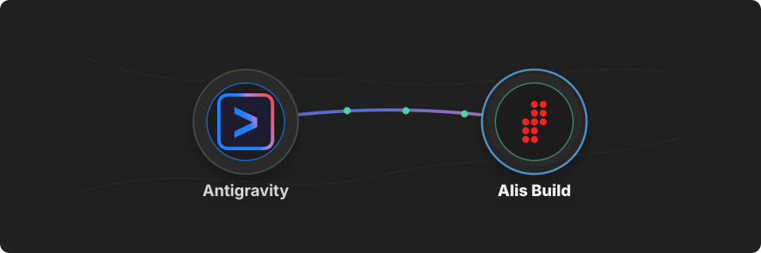

# Alis Build Antigravity Plugin

<p align="center">
  
</p>

<p align="center">
  <strong>Connect Google Antigravity to Alis Build.</strong>
</p>

Use this plugin to let Google Antigravity work with Alis Build organisations, products, neurons, builds, and deploys through the `alis` CLI, with the standing Alis Build context loaded into every session.

## What You Get

- The standing Alis Build Define-Build-Deploy primer (mental model + quiet, local-first skill discovery + CLI-first execution) always loaded from `GEMINI.md`
- Quiet, local-first discovery and capture skills: `alis-build-discover` activates on platform-shaped work (never on generic coding just because you are inside a workspace), probes the local catalog in ~40ms, and loads a registry skill only on a distinctive match; `alis-build-capture` turns just-completed work into a reusable team skill; `alis-build-getting-started` walks newcomers through their first Define-Build-Deploy cycle
- Tool policies that let plain `alis …` commands run without a confirmation prompt on every call, while `--confirm-production` (the production deploy gate), `--approve`, and `alis blocks uninstall … --yes` always reach you for confirmation

## Before You Start

You need:

- Google Antigravity installed (from [antigravity.google](https://antigravity.google))
- The [`alis` CLI](https://alis.build) installed, on your `PATH`, and signed in (`alis login`)
- An Alis Build account with access to the organisations and products you want to use

## Install

Install the plugin:

```sh
agy plugin install https://github.com/alis-build/antigravity-plugin
```

Or copy manually:

```sh
git clone https://github.com/alis-build/antigravity-plugin
mkdir -p ~/.gemini/config/plugins
cp -R antigravity-plugin ~/.gemini/config/plugins/alis-build
```

Restart Antigravity after installing.

## Use It

Ask Antigravity to use Alis Build — just describe what you want:

```text
build it
```

```text
fix it
```

```text
Use Alis Build to list the organisations I can access.
```

```text
Show recent builds for product os in organisation alis.
```

```text
Review the latest deploy logs for this neuron and suggest the next action.
```

Antigravity will ask before running tools that require approval.

The plugin's policies auto-approve single, simple `alis ...` shell commands so the CLI runs without a confirmation prompt each time. For safety the allow pattern only matches a lone invocation — anything that chains or redirects (`|`, `&&`, `||`, `;`, `&`, `>`, `<`, backticks, `$(...)`) falls through to Antigravity's normal confirmation flow. Commands carrying `--confirm-production` or `--approve`, and `alis blocks uninstall … --yes`, always prompt regardless — production deploys require explicit human approval by design.

## Skills

Discovery is skill-native: describe platform-shaped work in your own words and the `alis-build-discover` skill routes it — local catalog probe first, registry skill loaded only on a distinctive match, silence otherwise. Say "capture this as a skill" after solving something new and `alis-build-capture` saves it for your team.

## Primer sync

`GEMINI.md` is synced from the canonical primer in the Alis Build Claude Code plugin (`claude-plugin/plugins/alis-build/context/`, v0.21.0). The local differences are harness adaptations only: the Skills section names this plugin's `alis-build-discover` / `alis-build-capture` skills (Antigravity activates skills by description), and there is no hook-gated digest — Antigravity loads the context file whole. Sync the body on each claude-plugin primer release.

## Troubleshooting

If the primer or skills do not take effect, confirm the plugin is present at `~/.gemini/config/plugins/alis-build/` and restart Antigravity.

If `alis` commands fail with an auth error, run `alis login` (or `alis authorise <org>.<product>` for git/package credentials) and retry.
